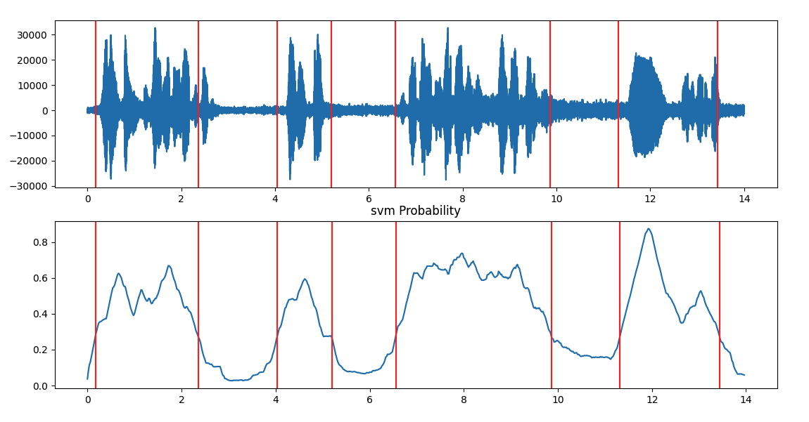

# segment_sound: A Python script to break an audio signal into audio segments using silence removal

`segment_sound` is a basic script to split a WAV file into segments
based on the existence of pauses between the corresponding segments. 
It uses the silence removal function `silence_removal()` frome the 
[pyAudioAnalysis](https://github.com/tyiannak/pyAudioAnalysis) library.

#### Requirements:
Tested in > Python3.6. To install requirements: `pip install -r requirements.txt`

#### Usage:
Execution:
```
python3 segment_audio.py -i <path_to_wav_file> -s <smoothing_window_in_secs> -t <energy_thres_0_to_1> -o <path_to_out_folder>
```
E.g
```
python3 segment_audio.py -i obama_speech_1.wav -s 0.75 -t 0.32 -o obama_segments_1
```

The above example results in the following:


Output audio segments are stored in WAV files in the output folder (provided as arg):
```
 ⇒ ls -1 obama_segments_1 
obama_speech_1_0.18_2.36.wav
obama_speech_1_11.32_13.44.wav
obama_speech_1_4.0200000000000005_5.2.wav
obama_speech_1_6.5600000000000005_9.9.wav
```

You obviously need to experiment with the two parameters depending on the 
level of background noise and on rate of the audio events (e.g. faster speech
may require smaller smoothing window).
